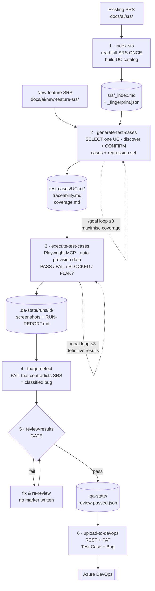
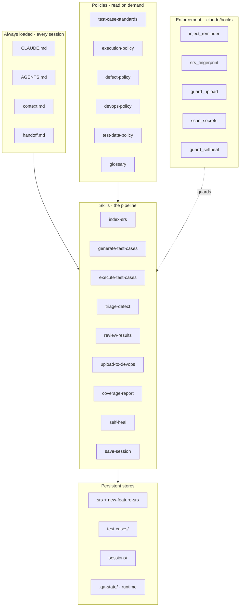
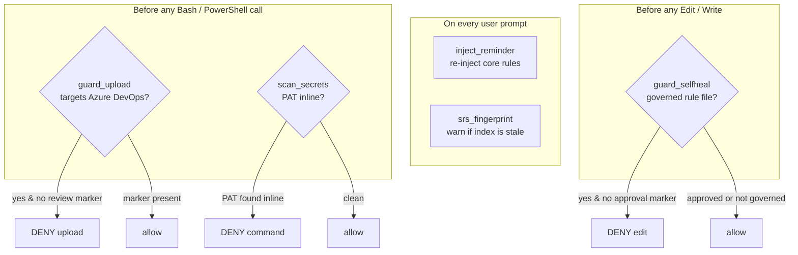
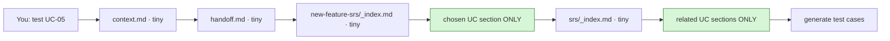
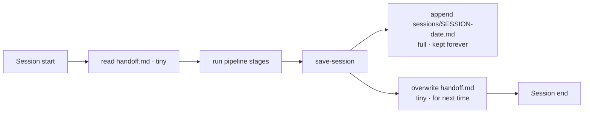

# Framework Architecture

Visual reference for the AI QA Framework. Diagrams are written in Mermaid and
render in GitHub, VS Code (with a Mermaid extension), and most Markdown viewers.

Contents:
1. [The pipeline](#1-the-pipeline-end-to-end) — end to end
2. [System layers](#2-system-layers) — what the files are
3. [Enforcement](#3-enforcement-hooks) — the hooks and what they gate
4. [Token-efficient read path](#4-token-efficient-read-path)
5. [Session lifecycle](#5-session-lifecycle)
6. [One-line mental model](#6-mental-model)

---

## 1. The pipeline (end to end)

The core flow: a single **chosen use case** travels from the SRS, through
generation and execution, past a review gate, into Azure DevOps. Cylinders are
persisted artifacts; the diamond is the human-approved gate.

**Reading it:** `index-srs` is the only full-SRS read and runs once. Everything
after is scoped to one use case. Stages 2 and 3 each run a bounded **`/goal` loop**
(≤3 rounds, early-stop on no progress) — generate iterates to maximise coverage,
execute iterates to drive every case to a definitive PASS/FAIL, **auto-provisioning**
missing prerequisite data (synthetic, test-env only) instead of blocking. The gate
(stage 5) is the single point that can authorize an upload — it writes a marker file
that stage 6's hook checks, after which results land in Azure DevOps.

---

## 2. System layers

Four kinds of files plus the persistent stores. Only the top layer is loaded
every session; everything else is read on demand.

**Reading it:** entry files tell the AI *what to read and when*; policies are the
*how-we-test* rules; skills are the *workflows*; hooks *enforce* the rules from
outside the model; stores hold everything that persists between sessions.

---

## 3. Enforcement (hooks)

Markdown rules are advisory; hooks are deterministic and run outside the model.
Diamonds are checks; a DENY blocks the tool call (exit code 2).

| Hook | Trigger | Guarantees |
|------|---------|-----------|
| `inject_reminder` | every prompt | core rules never drift out of context |
| `srs_fingerprint` | every prompt | warns when the use-case index is stale |
| `guard_upload` | shell calls | no DevOps upload before the review gate |
| `scan_secrets` | shell calls | the PAT is never inlined / leaked |
| `guard_selfheal` | Edit/Write | the AI cannot edit its own rules without approval |

All hooks **fail open** (a parse error or missing file = allow + no warning), so
they never block legitimate work — worst case they stay silent.

---

## 4. Token-efficient read path

What actually gets loaded for one run. Green = the only substantial reads, and
they are single sections — never the whole SRS.

**Reading it:** the full SRS is read **once** (at `index-srs`). Every test run
reads only small index files plus the one use case in scope and its confirmed
related sections. Downstream stages (execute / triage / upload) read
`test-cases/` and `.qa-state/` — they never reopen the SRS.

---

## 5. Session lifecycle

History uses a hybrid: a tiny always-read handoff + a full append-only archive.

**Reading it:** you get a complete audit trail (the `sessions/` pile never
shrinks) without growing per-session token cost — only the small handoff is read
next time; a specific session file is opened only on request.

---

## 6. Mental model

> **Pick a use case → the framework reads only that slice of the spec, discovers
> what it touches (with your confirmation), tests it in a real browser, files real
> bugs, and — only after a review gate — pushes everything to Azure DevOps, with
> hooks making the safety rules unbreakable, a self-heal loop improving the rules
> on your approval, and session handoffs preserving continuity.**
