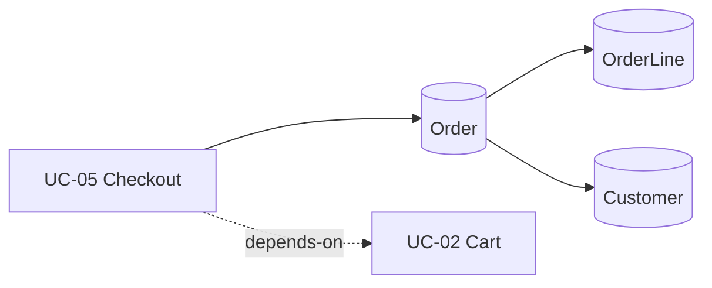

# System Graph

A consolidated, queryable model of the application: typed edges between use cases,
roles, entities, states, routes, and API endpoints. Skills **traverse** this (the chosen
use case's neighborhood) instead of re-deriving relationships every run — improving
discovery, provisioning order, and impact analysis.

- Built/updated by **index-srs** from the SRS + `decisions.md` + `app-map.md`.
- Each edge is **stated** (`✓` — from the SRS/app-map) or **inferred** (`?` — black-box
  means structure is *observed*, not read from code; inferred edges must be confirmed).
- Keep it **compact** — an edge list, not prose. Read only a use case's neighborhood.
- Rebuilt by index-srs when the baseline SRS changes (same trigger as the index fingerprint).

## Nodes
`UC-###` use cases · `Role` · `Entity` · `State` · `/route` · `API` endpoint

## Edges  — format: `SOURCE --type--> TARGET   [✓|?]   note`

### Use-case relationships  (mirrors the index Depends-on / Related)
```
UC-01 --depends-on--> UC-00      [✓]
UC-05 --related-----> UC-02      [?]  shared entity
```
### Actors (use case → role)  (mirrors permission-matrix)
```
UC-05 --actor--> Admin           [✓]
UC-05 --actor--> Manager         [✓]
```
### Use case → entity (reads / writes)
```
UC-05 --writes--> Order          [✓]
UC-05 --reads---> Customer       [✓]
```
### Entity data model  (the high-value layer — drives provisioning & dependencies)
```
Order --has-many---> OrderLine   [✓]
Order --refers-to--> Customer    [✓]
```
### Entity states
```
Order : Draft -> Submitted -> Approved -> Closed    [✓]
```
### Routes (use case → UI route)  (from app-map)
```
UC-05 --route--> /checkout       [✓]
```
### API (entity → seeding endpoint)  (from app-map)
```
Order --api--> POST /api/orders  [?]
```

## Optional visual (render a neighborhood on request)


> Empty until `index-srs` builds it. Replace the EXAMPLE edges above with your system;
> mark every inferred edge `?` and confirm it with the team.
